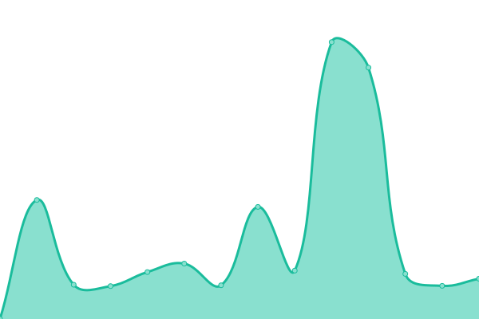
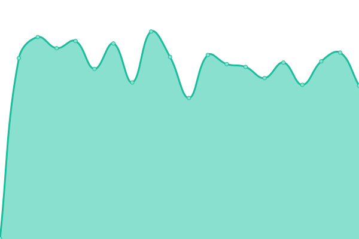

# [📈 Live Status](https://status.drgn.xyz): <!--live status--> **🟧 Partial outage**

This repository contains the open-source uptime monitor and status page for [ericdrgn](https://status.drgn.xyz), powered by [Upptime](https://github.com/upptime/upptime).

With [Upptime](https://upptime.js.org), you can get your own unlimited and free uptime monitor and status page, powered entirely by a GitHub repository. We use [Issues](https://github.com/ericdrgn/drgnstats/issues) as incident reports, [Actions](https://github.com/ericdrgn/drgnstats/actions) as uptime monitors, and [Pages](https://status.drgn.xyz) for the status page.

<!--start: status pages-->
<!-- This summary is generated by Upptime (https://github.com/upptime/upptime) -->
<!-- Do not edit this manually, your changes will be overwritten -->
<!-- prettier-ignore -->
| URL | Status | History | Response Time | Uptime |
| --- | ------ | ------- | ------------- | ------ |
|  [Cloud](https://cloud.drgn.xyz) | 🟩 Up | [cloud.yml](https://github.com/ericdrgn/drgn.status/commits/HEAD/history/cloud.yml) | 

 407ms
     
 | 

<a href="https://status.drgn.xyz/history/cloud">100.00%</a>
    

|  [Git](https://git.drgn.xyz) | 🟩 Up | [git.yml](https://github.com/ericdrgn/drgn.status/commits/HEAD/history/git.yml) | 

 372ms
     
 | 

<a href="https://status.drgn.xyz/history/git">100.00%</a>
    

|  [Matrix](https://matrix.drgn.im) | 🟩 Up | [matrix.yml](https://github.com/ericdrgn/drgn.status/commits/HEAD/history/matrix.yml) | 

 489ms
     
 | 

<a href="https://status.drgn.xyz/history/matrix">100.00%</a>
    

|  [Vault](https://vault.drgn.xyz) | 🟩 Up | [vault.yml](https://github.com/ericdrgn/drgn.status/commits/HEAD/history/vault.yml) | 

 259ms
     
 | 

<a href="https://status.drgn.xyz/history/vault">100.00%</a>
    

|  [Social](https://drgn.social) | 🟥 Down | [social.yml](https://github.com/ericdrgn/drgn.status/commits/HEAD/history/social.yml) | 

 0ms
     
 | 

<a href="https://status.drgn.xyz/history/social">0.00%</a>
    

|  [Search](https://search.drgn.xyz) | 🟩 Up | [search.yml](https://github.com/ericdrgn/drgn.status/commits/HEAD/history/search.yml) | 

 254ms
     
 | 

<a href="https://status.drgn.xyz/history/search">100.00%</a>
    

|  [File Share](https://share.drgn.xyz) | 🟩 Up | [file-share.yml](https://github.com/ericdrgn/drgn.status/commits/HEAD/history/file-share.yml) | 

 192ms
     
 | 

<a href="https://status.drgn.xyz/history/file-share">100.00%</a>
    

<!--end: status pages-->

[**Visit our status website →**](https://status.drgn.xyz)

## 📄 License

- Powered by: [Upptime](https://github.com/upptime/upptime)
- Code: [MIT](./LICENSE) © [ericdrgn](https://status.drgn.xyz)
- Data in the `./history` directory: [Open Database License](https://opendatacommons.org/licenses/odbl/1-0/)
